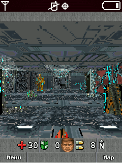

# DOOM-RPG-BREW-PATCH

## Español
Este es un pequeño programa que corrige el error de píxeles en Doom RPG BREW, para que se vea correctamente en otros dispositivos BREW.

**A que se debio el error?:** el error se originó ya que al momento de cargar los datos (stexels,wtexels), el sistema lee 256 bytes por bloque hasta terminar de leer el archivo, al parecer algunos dispositivos BREW creaban una incompatibilidad al leer los datos.

**Solución:**  cambie el valor de 256 a 1, así el sistema leerá los datos pixel por pixel y no por bloques de 256, de ese modo el error se corrige, permitiendo que las texturas y sprites se vean correctamente.

**Modo de uso:** Solo necesita el archivo doomrpg.mod en la carpeta del programa, este generará un archivo con el nombre doomrpg_fix.mod.

## English
This is a small program that fixes the pixel error in Doom RPG BREW, so that it looks correctly on other BREW devices.

**What was the error?:** The error originated because when loading the data (stexels, wtexels), the system reads 256 bytes per block until it finished reading the file, apparently some BREW devices created an incompatibility when reading the data.

**Solution:** change the value from 256 to 1, so the system will read the data pixel by pixel and not by blocks of 256, in this way the error is corrected, allowing the textures and sprites to be seen correctly.

**How to use:** You only need the file doomrpg.mod in the program folder, this will generate a file with the name doomrpg_fix.mod.
